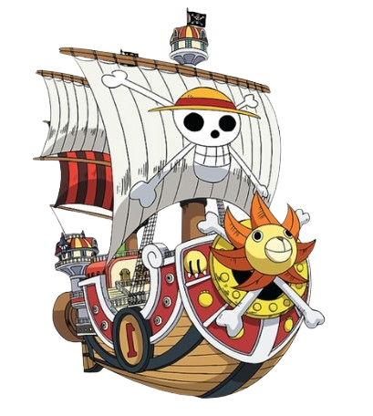
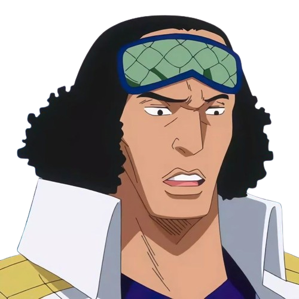
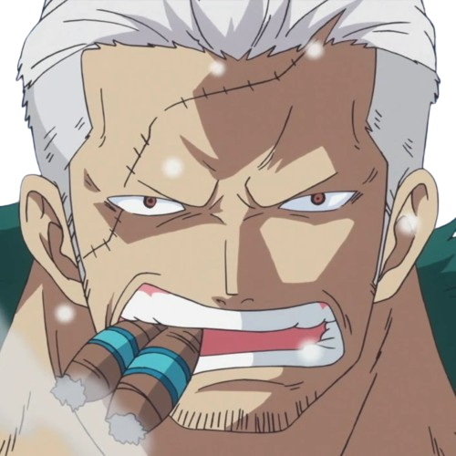
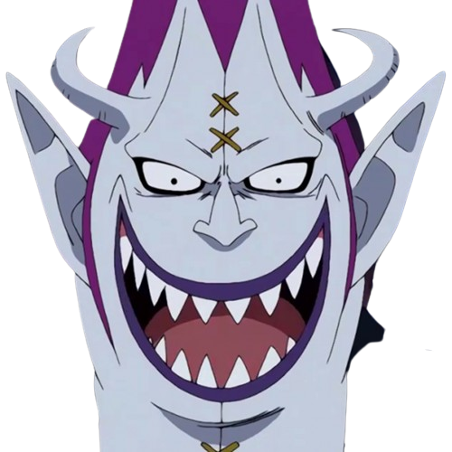
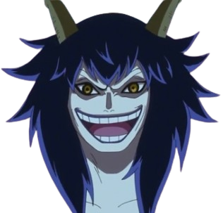

# ONEPIECEGAME2.0
Código HTML proposto em sala, segunda versão

<!DOCTYPE html>
<html lang="pt-br">
<head>
    <meta charset="UTF-8">
    <meta http-equiv="X-UA-Compatible" content="IE=edge">
    <meta name="viewport" content="width=device-width, initial-scale=1.0">
    <title>ONE PIECE MINIGAME</title>
    <link rel="stylesheet" type="text/css" href="style.css">
</head>
<body>
    <!-- Imagem que será movida -->
    
    
    
    
    
    
    
    
    
    
    

    <!-- Tela de parabéns -->
    

        

        <h1>PARABÉNS!</h1>
        
Você reuniu todos  
            os chapéu de palha!
        

        <!-- Adicionando o botão -->
        <a href="viloes.html" class="botao">PRÓXIMA FASE</a>
         

        

        
        

    

</body>
</html>

body {
    font-family: Arial, sans-serif;
    background-image: url("marxd.png"); /* substitua pelo caminho da sua imagem */
    background-size: cover; /* para cobrir toda a área */
    color: white; /* cor do texto para melhorar a legibilidade */
}   
body {
    margin: 0;
    overflow: hidden; /* Impede a barra de rolagem */
    background-color: #f0f0f0; /* Cor de fundo */
}
#container {
    position: relative;
    width: 100%;
    height: 100vh; /* Altura total da tela visível */
}
img {
    position: absolute;
}
h1 {
    color: blue;
}
#parabens {
    display: none; /* Inicialmente esconde o elemento */
    position: absolute; /* Alterado para 'absolute' para que ele fique centralizado em relação ao conteúdo */
    top: 310px; /* Posiciona o topo no meio vertical */
    left: 680px; /* Posiciona a esquerda no meio horizontal */
    transform: translate(-50%, -50%); /* Move o elemento 50% do seu próprio tamanho para o centro, tanto vertical quanto horizontalmente */
    background-color: #ffb444;
    border: 5px solid #795014;
    padding: 40px;
    text-align: left;
    width: 400px;
    border-radius: 40px;
    display: inline-block;
}

    #parabens img.bau {
        position: absolute;
        top: 50%;
        right: 4px; /* Posiciona a imagem à direita */
        transform: translateY(-50%);
        width: 230px;
        height: auto;
    }
#parabens h1 {
    font-size: 28px; /* Aumentei o tamanho da fonte */
    color: #795014; /* Cor do texto */
    margin-bottom: 10px;
    font-family: 'Gill Sans', 'Gill Sans MT', Calibri, 'Trebuchet MS', sans-serif; /* Fonte Gill Sans */
}

#parabens p {
    font-size: 20px;
    color: #9d6300;
    margin-top: 10px;
    font-family: 'Lucida Sans', 'Lucida Sans Regular', 'Lucida Grande', 'Lucida Sans Unicode', Geneva, Verdana, sans-serif;
    position: relative;
}

#parabens {
    position: relative; /* Alterado para relativo para que a imagem fique posicionada em relação a este div */
    /* Estilos anteriores... */
}

p {
    font-size: 16px;
    line-height: 1.5;
}
        /* Estilos CSS para a imagem */
        #imagem {
            position: absolute;
            top: 50px;
            left: 50px;
            width: 150px; /* Defina a largura desejada */
            height: auto; /* Mantém a proporção da imagem */
        }
        #imagem2 {
            position: absolute;
            top: 10px;
            left: 730px;
            width: 150px; /* Defina a largura desejada */
            height: auto; /* Mantém a proporção da imagem */
        }
        #imagem3 {
            position: absolute;
            top: 90px;
            left: 340px;
            width: 130px; /* Defina a largura desejada */
            height: auto; /* Mantém a proporção da imagem */
        }
        #imagem4 {
            position: absolute;
            top: 80px;
            left: 1180px;
            width: 100px; /* Defina a largura desejada */
            height: auto; /* Mantém a proporção da imagem */
        }
        #imagem5 {
            position: absolute;
            top: 270px;
            left: 50px;
            width: 150px; /* Defina a largura desejada */
            height: auto; /* Mantém a proporção da imagem */
        }
        #imagem6 {
            position: absolute;
            top: 310px;
            left: 420px;
            width: 150px; /* Defina a largura desejada */
            height: auto; /* Mantém a proporção da imagem */
        }
        #imagem7 {
            position: absolute;
            top: 250px;
            left: 700px;
            width: 175px; /* Defina a largura desejada */
            height: auto; /* Mantém a proporção da imagem */
        }
        #imagem8 {
            position: absolute;
            top: 250px;
            left: 1050px;
            width: 150px; /* Defina a largura desejada */
            height: auto; /* Mantém a proporção da imagem */
        }
        #imagem9 {
            position: absolute;
            top: 450px;
            left: 210px;
            width: 150px; /* Defina a largura desejada */
            height: auto; /* Mantém a proporção da imagem */
        }
        #imagem10 {
            position: absolute;
            top: 460px;
            left: 860px;
            width: 190px; /* Defina a largura desejada */
            height: auto; /* Mantém a proporção da imagem */
        }
        #imagem11 {
            position: absolute;
            top: 460px;
            left: 620px;
            width: 100px; /* Defina a largura desejada */
            height: auto; /* Mantém a proporção da imagem */
        }

        .botao {
            display: inline-block;
            padding: 10px 20px;
            background-color: #753a09;
            color: white;
            text-decoration: none;
            border-radius: 5px;
            font-size: 16px;
            margin-top: 20px; /* Adicione margem superior para separar do texto */
        }
        
        .botao:hover {
            background-color: #45a049;
        }

<!DOCTYPE html>
<html lang="pt-br">
<head>
    <meta charset="UTF-8">
    <meta http-equiv="X-UA-Compatible" content="IE=edge">
    <meta name="viewport" content="width=device-width, initial-scale=1.0">
    <title>VILOES</title>
    <link rel="stylesheet" type="text/css" href="style2.css">
</head>
<body>
    <!-- Imagem do Sunny -->
    

    <!-- Imagens alvo -->
        <!-- Imagens alvo -->
        
        
        
        
        
        
        
        
        
        
        
        
        
        
        
        
        

     
</body>
</html>

body {
    margin: 0;
    overflow: hidden;
    background-image: url("marxd.png");
    background-size: cover;
}

#sunny {
    position: absolute;
    left: 50px; /* Ajuste a posição inicial conforme necessário */
    top: 50%; /* Centraliza verticalmente */
    width: 150px;
}

#alvo {
    position: absolute;
    left: 800px; /* Ajuste a posição conforme necessário */
    top: 440px; /* Centraliza verticalmente */
    width: 110px;
    transform: translateY(-50%);
}
#alvo2 {
    position: absolute;
    left: 800px; /* Ajuste a posição conforme necessário */
    top: 90px; /* Centraliza verticalmente */
    width: 110px;
    transform: translateY(-50%);
}
#alvo3 {
    position: absolute;
    left: 800px; /* Ajuste a posição conforme necessário */
    top: 210px; /* Centraliza verticalmente */
    width: 110px;
    transform: translateY(-50%);
}
#alvo4 {
    position: absolute;
    left: 800px; /* Ajuste a posição conforme necessário */
    top: 560px; /* Centraliza verticalmente */
    width: 110px;
    transform: translateY(-50%);
}
#alvo5 {
    position: absolute;
    left: 950px; /* Ajuste a posição conforme necessário */
    top: 560px; /* Centraliza verticalmente */
    width: 110px;
    transform: translateY(-50%);
}
#alvo6 {
    position: absolute;
    left: 1090px; /* Ajuste a posição conforme necessário */
    top: 560px; /* Centraliza verticalmente */
    width: 110px;
    transform: translateY(-50%);
}
#alvo7 {
    position: absolute;
    left: 1090px; /* Ajuste a posição conforme necessário */
    top: 210px; /* Centraliza verticalmente */
    width: 110px;
    transform: translateY(-50%);
}
#alvo8 {
    position: absolute;
    left: 1090px; /* Ajuste a posição conforme necessário */
    top: 440px; /* Centraliza verticalmente */
    width: 110px;
    transform: translateY(-50%);
}
#alvo9 {
    position: absolute;
    left: 1090px; /* Ajuste a posição conforme necessário */
    top: 50%; /* Centraliza verticalmente */
    width: 110px;
    transform: translateY(-50%);
}
#alvo10 {
    position: absolute;
    left: 1090px; /* Ajuste a posição conforme necessário */
    top: 90px; /* Centraliza verticalmente */
    width: 110px;
    transform: translateY(-50%);
}
#alvo11 {
    position: absolute;
    left: 950px; /* Ajuste a posição conforme necessário */
    top: 440px; /* Centraliza verticalmente */
    width: 110px;
    transform: translateY(-50%);
}
#alvo12 {
    position: absolute;
    left: 950px; /* Ajuste a posição conforme necessário */
    top: 90px; /* Centraliza verticalmente */
    width: 110px;
    transform: translateY(-50%);
}
#alvo13 {
    position: absolute;
    left: 950px; /* Ajuste a posição conforme necessário */
    top: 210px; /* Centraliza verticalmente */
    width: 110px;
    transform: translateY(-50%);
}
#alvo14 {
    position: absolute;
    left: 950px; /* Ajuste a posição conforme necessário */
    top: 50%; /* Centraliza verticalmente */
    width: 110px;
    transform: translateY(-50%);
}
#alvo15 {
    position: absolute;
    left: 1225px; /* Ajuste a posição conforme necessário */
    top: 210px; /* Centraliza verticalmente */
    width: 110px;
    transform: translateY(-50%);
}
#alvo16 {
    position: absolute;
    left: 1225px; /* Ajuste a posição conforme necessário */
    top: 440px; /* Centraliza verticalmente */
    width: 110px;
    transform: translateY(-50%);
}
#alvo17 {
    position: absolute;
    left: 800px; /* Ajuste a posição conforme necessário */
    top: 50%; /* Centraliza verticalmente */
    width: 110px;
    transform: translateY(-50%);
}

.bolinha {
    position: absolute;
    width: 20px; /* Ajuste o tamanho da bolinha conforme necessário */
    height: 20px;
    background-color: rgb(7, 1, 15); /* Cor da bolinha */
    border-radius: 50%; /* Torna a bolinha circular */
    opacity: 5px;
}
